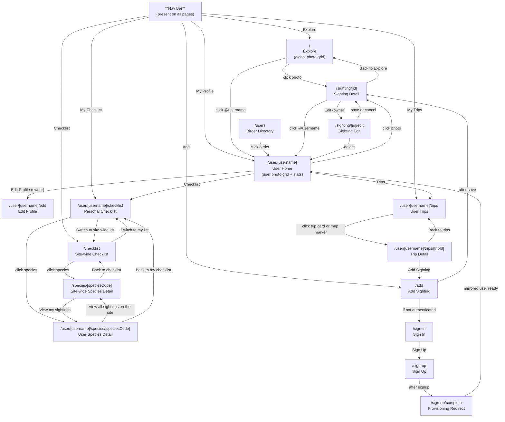

# Site Layout

BirdMog is now organized around a public Explore surface plus user-scoped logs. Public pages show site-wide activity; `/user/[username]` pages show one birder's sightings, trips, checklist, and species history.

## Routes

- `/` - **Explore.** Public photo grid of every user's sightings.
- `/user/[username]` - **User home.** User-scoped photo grid, profile stats, bio, and owner-only Edit Profile link.
- `/user/[username]/trips` - **User trips.** Trips derived from that user's sightings.
- `/user/[username]/trips/[tripId]` - **User trip detail.** One user-scoped trip with its sightings.
- `/user/[username]/checklist` - **Personal checklist.** Species seen by that user, with a link to the site-wide checklist.
- `/user/[username]/species/[speciesCode]` - **User species detail.** That user's sightings, lifer date, and photos for one species.
- `/checklist` - **Site-wide checklist.** Species seen by anyone on the site, with a signed-in link to the viewer's personal checklist.
- `/species/[speciesCode]` - **Site-wide species detail.** All sightings of one species across the site.
- `/users` - **Birder directory.** Public user list sortable by recent activity or lifer count.
- `/sighting/[id]` - **Sighting detail.** Global sighting page with a link to the poster's profile.
- `/sighting/[id]/edit` - **Sighting edit.** Owner-only edit form; save returns to sighting detail and delete returns to the owner profile.
- `/add` - **Add sighting.** Signed-in sighting creation flow.
- `/sign-in` - **Sign in.**
- `/sign-up` - **Sign up.**
- `/sign-up/complete` - **Provisioning redirect.** Waits for the mirrored user row, then sends the new user to their profile.

## Navigation

- Signed out: **Explore · Checklist · Sign In**
- Signed in: **Explore · My Profile · My Trips · My Checklist · Add**

Signed-in profile, trips, and checklist links resolve through the mirrored `users.username` row returned by `/api/users/me`.

## Diagram

## Source Files

| Page or area | Route | Source file |
| --- | --- | --- |
| Nav Bar | all pages | `src/components/Nav.tsx` |
| Explore | `/` | `src/app/page.tsx`, `src/components/PhotoGridLoader.tsx`, `src/components/PhotoGrid.tsx` |
| User Home | `/user/[username]` | `src/app/user/[username]/page.tsx` |
| Edit Profile | `/user/[username]/edit` | `src/app/user/[username]/edit/page.tsx`, `src/app/user/[username]/edit/ProfileEditForm.tsx` |
| User Trips | `/user/[username]/trips` | `src/app/user/[username]/trips/page.tsx`, `src/components/TripCard.tsx`, `src/components/TripsMap.tsx` |
| User Trip Detail | `/user/[username]/trips/[tripId]` | `src/app/user/[username]/trips/[tripId]/page.tsx` |
| Personal Checklist | `/user/[username]/checklist` | `src/app/user/[username]/checklist/page.tsx`, `src/app/user/[username]/checklist/ChecklistClient.tsx` |
| User Species Detail | `/user/[username]/species/[speciesCode]` | `src/app/user/[username]/species/[speciesCode]/page.tsx` |
| Site-wide Checklist | `/checklist` | `src/app/checklist/page.tsx` |
| Site-wide Species Detail | `/species/[speciesCode]` | `src/app/species/[speciesCode]/page.tsx` |
| Birder Directory | `/users` | `src/app/users/page.tsx` |
| Sighting Detail | `/sighting/[id]` | `src/app/sighting/[id]/page.tsx` |
| Sighting Edit | `/sighting/[id]/edit` | `src/app/sighting/[id]/edit/page.tsx`, `src/app/sighting/[id]/edit/EditForm.tsx` |
| Add Sighting | `/add` | `src/app/add/page.tsx`, `src/components/SightingForm.tsx` |
| Sign In | `/sign-in` | `src/app/sign-in/[[...sign-in]]/page.tsx` |
| Sign Up | `/sign-up` | `src/app/sign-up/[[...sign-up]]/page.tsx` |
| Signup Complete | `/sign-up/complete` | `src/app/sign-up/complete/page.tsx`, `src/app/sign-up/complete/ProvisioningRedirect.tsx` |

## APIs

- `GET /api/sightings` - returns sightings with `username` and `displayName`; accepts optional `userId`.
- `POST /api/sightings` - creates a signed-in user's sighting.
- `GET /api/sightings/[id]` - returns one sighting and photos.
- `PUT /api/sightings/[id]` and `DELETE /api/sightings/[id]` - owner-only mutation routes.
- `GET /api/trips` - returns computed trips; accepts optional `userId`.
- `GET /api/users` - user directory data with stats.
- `GET /api/users/me` - signed-in mirrored user row.
- `PUT /api/users/me` - app-owned profile fields only.
- `GET /api/users/[username]` - public user profile stats.
- `POST /api/webhooks/clerk` - Clerk user mirror webhook.
