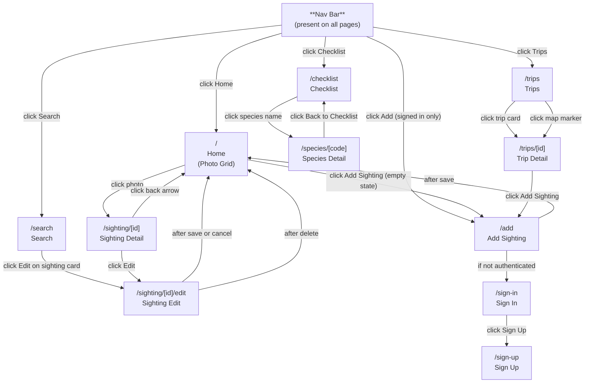

# Site Layout

```mermaid
flowchart TD
    Nav["**Nav Bar**\n(present on all pages)"]

    Home["/\nHome\n(Photo Grid)"]
    Trips["/trips\nTrips"]
    TripDetail["/trips/[id]\nTrip Detail"]
    Checklist["/checklist\nChecklist"]
    SpeciesDetail["/species/[code]\nSpecies Detail"]
    Search["/search\nSearch"]
    SightingDetail["/sighting/[id]\nSighting Detail"]
    SightingEdit["/sighting/[id]/edit\nSighting Edit"]
    AddSighting["/add\nAdd Sighting"]
    SignIn["/sign-in\nSign In"]
    SignUp["/sign-up\nSign Up"]

    Nav -->|"click Home"| Home
    Nav -->|"click Trips"| Trips
    Nav -->|"click Checklist"| Checklist
    Nav -->|"click Search"| Search
    Nav -->|"click Add (signed in only)"| AddSighting

    Home -->|"click photo"| SightingDetail
    Home -->|"click Add Sighting (empty state)"| AddSighting

    Checklist -->|"click species name"| SpeciesDetail
    SpeciesDetail -->|"click Back to Checklist"| Checklist

    Trips -->|"click trip card"| TripDetail
    Trips -->|"click map marker"| TripDetail
    TripDetail -->|"click Add Sighting"| AddSighting

    Search -->|"click Edit on sighting card"| SightingEdit

    SightingDetail -->|"click back arrow"| Home
    SightingDetail -->|"click Edit"| SightingEdit
    SightingEdit -->|"after save or cancel"| Home
    SightingEdit -->|"after delete"| Home

    AddSighting -->|"if not authenticated"| SignIn
    AddSighting -->|"after save"| Home

    SignIn -->|"click Sign Up"| SignUp
```
