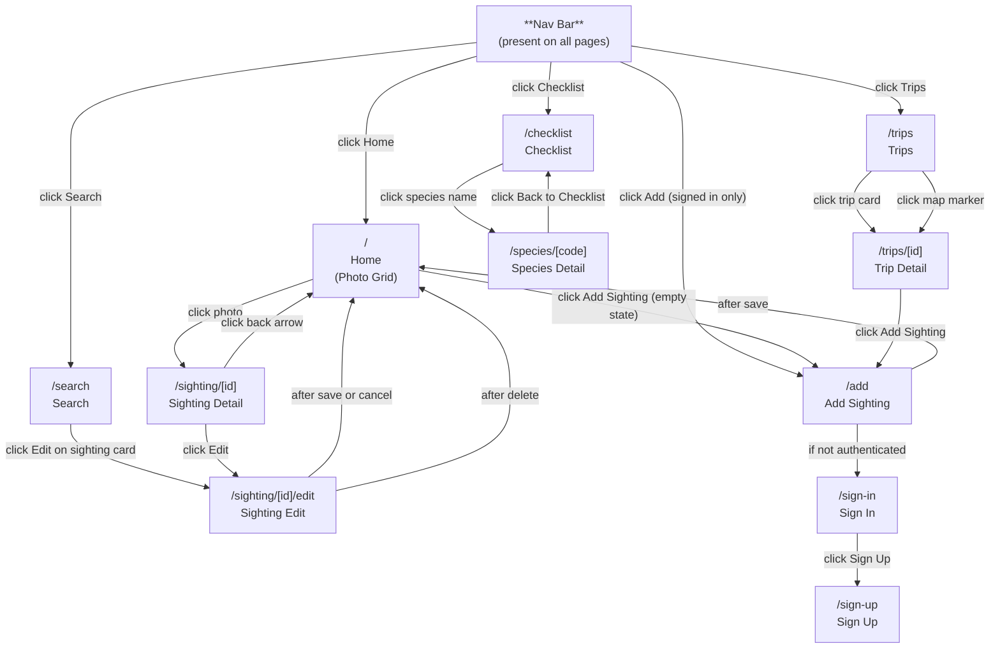
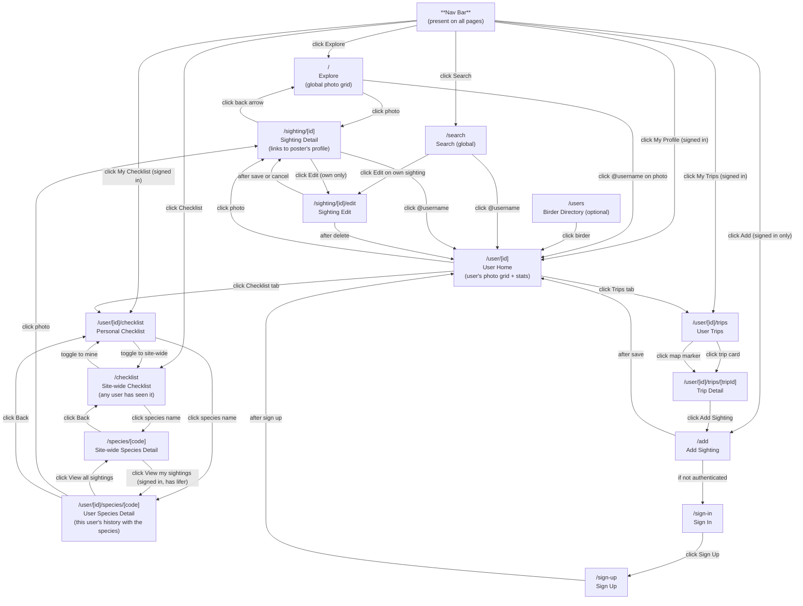

# Site Layout

## Source files

| Node | Route | Source file |
|------|-------|-------------|
| Nav Bar | (all pages) | `src/components/Nav.tsx` |
| Home | `/` | `src/app/page.tsx`, `src/components/PhotoGrid.tsx` |
| Trips | `/trips` | `src/app/trips/page.tsx`, `src/components/TripCard.tsx`, `src/components/TripsMap.tsx` |
| Trip Detail | `/trips/[id]` | `src/app/trips/[id]/page.tsx` |
| Checklist | `/checklist` | `src/app/checklist/page.tsx` |
| Species Detail | `/species/[code]` | `src/app/species/[speciesCode]/page.tsx` |
| Search | `/search` | `src/app/search/page.tsx`, `src/components/SightingCard.tsx` |
| Sighting Detail | `/sighting/[id]` | `src/app/sighting/[id]/page.tsx` |
| Sighting Edit | `/sighting/[id]/edit` | `src/app/sighting/[id]/edit/page.tsx`, `src/app/sighting/[id]/edit/EditForm.tsx` |
| Add Sighting | `/add` | `src/app/add/page.tsx`, `src/components/SightingForm.tsx` |
| Sign In | `/sign-in` | `src/app/sign-in/[[...sign-in]]/page.tsx` |
| Sign Up | `/sign-up` | `src/app/sign-up/[[...sign-up]]/page.tsx` |

## Proposed layout (multi-user)

Now that sightings belong to a user, the site needs to distinguish "the whole site" from "one birder's log." The proposal below splits those two views without doubling the page count: the homepage becomes a public **Explore** feed, and each user gets a `/user/[id]` hub that re-skins the existing photo grid, trips, and checklist as user-scoped.

### Goals

- **Public-by-default discovery.** A signed-out visitor lands on a feed of everyone's recent sightings, not a sign-in wall.
- **A clear "this is me" surface.** Signed-in users always have one click to their own profile and their own trips/checklist.
- **Reuse the existing pages.** Trips, checklist, and the photo grid already exist — they just need an optional user filter rather than new components.
- **Keep sighting/species detail global.** Those are shared records; they should link *to* a user, not live under one.

### Routing changes

- `/` — **Explore.** Public photo grid of every user's sightings. Replaces today's home grid for signed-out visitors; signed-in users see the same global feed (a "View my photos" shortcut sends them to their profile).
- `/user/[id]` — **User home.** Photo grid scoped to one user. Header shows display name, lifer count, trip count, and (if it's the viewer) an Edit Profile / Settings affordance.
- `/user/[id]/trips` and `/user/[id]/trips/[tripId]` — Trips become user-scoped. The current `/trips` route redirects: signed-in → `/user/[me]/trips`, signed-out → hidden from the nav (or pointed at Explore).
- `/user/[id]/checklist` — Per-user life list. This is the "what have *I* seen" view.
- `/user/[id]/species/[code]` — **Per-user species page.** Shows that user's history with one species: their sightings of it, photos, dates, locations, lifer date. Links up to the site-wide species page ("View all sightings on the site"). Reached by clicking a species from the personal checklist or from one of the user's own sighting cards.
- `/checklist` — **Stays as the site-wide checklist.** Shows a species as "seen" if *anyone* on the site has logged it. Useful as a discovery tool ("what species exist on this site?") and satisfies the global-checklist requirement.
- `/species/[code]` — **Site-wide species page** (existing). All sightings of a species across the site. From here, a signed-in viewer who has logged this species sees a "View my sightings" link back to `/user/[me]/species/[code]`.
- `/users` *(optional, low priority)* — Directory of birders, sortable by lifer count or recent activity. Worth deferring until there are enough users to make it interesting.
- `/sighting/[id]`, `/search`, `/add`, `/sign-in`, `/sign-up` — unchanged. Sighting detail gains a "by @username" link to the poster's profile.

### Nav changes

- Signed out: **Explore · Checklist · Search · Sign In**
- Signed in: **Explore · My Profile · My Trips · My Checklist · Search · Add** (My Profile/Trips/Checklist resolve to `/user/[me]/...`)
- A site-wide checklist link can live on the personal checklist page as a toggle ("My list / Everyone's list") rather than a separate nav entry, to keep the bar short.

### Things worth deciding before building

- **User ID shape.** `/user/[clerkId]` is ugly; `/user/[username]` is friendlier but requires a unique-username constraint and a profile table. Recommend adding a lightweight `users` table now (id, username, displayName, createdAt) so URLs are stable.
- **Privacy.** Are profiles public by default? If yes, no extra work. If some users want private logs, add a `users.visibility` field — but defer until someone asks.
- **Trip ownership on existing data.** Trips today are derived from sightings; once they're user-scoped this stays true (a trip = contiguous sightings by one user at one location). No migration needed, just a `WHERE user_id = ?` filter.

### Proposed diagram

### New / changed source files

| Node | Route | Source file (proposed) |
|------|-------|-------------|
| Explore | `/` | `src/app/page.tsx` (rename intent; keep PhotoGrid, drop user filter) |
| User Home | `/user/[id]` | `src/app/user/[id]/page.tsx` |
| User Trips | `/user/[id]/trips` | `src/app/user/[id]/trips/page.tsx` |
| User Trip Detail | `/user/[id]/trips/[tripId]` | `src/app/user/[id]/trips/[tripId]/page.tsx` |
| Personal Checklist | `/user/[id]/checklist` | `src/app/user/[id]/checklist/page.tsx` |
| User Species Detail | `/user/[id]/species/[code]` | `src/app/user/[id]/species/[speciesCode]/page.tsx` |
| Site Checklist | `/checklist` | `src/app/checklist/page.tsx` (existing — adjust to count any-user) |
| Site Species Detail | `/species/[code]` | `src/app/species/[speciesCode]/page.tsx` (existing — add "View my sightings" link) |
| Birder Directory *(optional)* | `/users` | `src/app/users/page.tsx` |
| Users table | — | `src/db/schema.ts` (add `users` table) |
| User-scoped APIs | — | `/api/sightings?userId=...`, `/api/trips?userId=...` (add filter param) |
